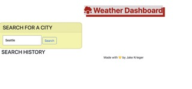
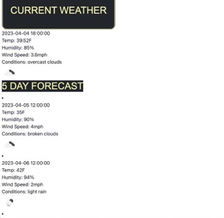

# Weather-Dashboard
Use the 5 Day Weather Forecast to retrieve weather data for cities. Type in any city into the search bar to get the weather data for that current time and day as well as the future forecast of that city. To make it easier to remember where you have searched the search history will be at the bottom of the page and will be activated upon "click".

Application live at: 

## Installation
Made using the latest versions of GitHub, Bootstrap, Dayjs, Visual Studio Code, and jQuery. APIs used for this application are OpenWeatherAPI and GeoLocator API that finds the city based on geographical coordinates.

## Usage
When the user loads the page the current weather container and forecasted weather data containers will not be visible.

When the user enters a city into the search bar teh current weather as well as the forecasted data will be displayed in containers.

## Support
For support, email me at jkrieger11@gmail.com .

## Roadmap
Application has no plans for future updates.

## Contributing
N/A

## Authors and acknowledgment
Jake Krieger 
[GitHub](https://github.com/jkrieger6?tab=repositories "GitHub Home")

## License
None

## Project status
Development for this application has stopped. If you wish to add anything to existing code, please use the email listed in support for questions, comments, or ideas.